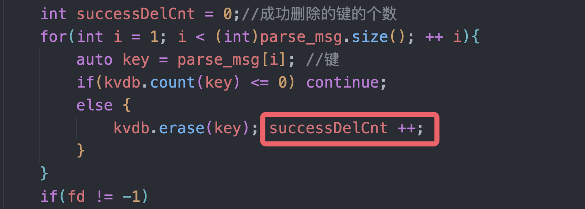

一个节点可以处于三种状态的一种：Followers、Candidate、Leader。

1. Leader Election

所有节点以Followers状态启动，如果Followers没有听到Leader的消息，那么它可以成为Candidate。

然后Candidate会请求其他节点投票，其他节点回复投票，如果Candidate从大多数节点获取选票，则称为Leader

现在对所有系统的更改都通过领导者，每个信息（更改）都会成为条目添加到节点的日志中。

2. 日志复制
   1. 客户端仅通过Leader与集群进行交互，比如发送了一个`SET 5`的命令，Leader是不能立即提交的。
   2. 要提交这个条目，需要将这个命令复制到其他跟随者节点，然后Leader等待直到大多数节点写入了这个条目，此时Leader才能提交。
   3. 然后Leader通知跟随者该条目已提交，使跟随者的条目也提交。

两个超时：

1. 选举超时。追随者在成为候选人之前等待的时间，当选举超时后，追随者成为候选人并开始新的选取周期。（150ms - 300ms）

## 投票规则

1. 候选人的日志信息至少要和自己一样新，如果候选人的日志信息滞后于某一个跟随者，那么此跟随者会拒绝投票，因为自己有更新的日志记录。
2. 跟随着节点会比较候选人和自己的日志，以确定哪个更新：
   1. 比较最后一条日志的任期，任期大的日志更新；
   2. 如果相同，则比较最后一条日志的索引，索引大的新。

## 2023-05-21

完成了选举过程的一些函数，剩下flower接受heartbeat如何处理没写。

当客户端向某一个固定的机子发送请求的时候，可以遍历整个集群，然后找到leader，并将信息发送过去。

## 2023-05-22

不考虑集群中的机子会crash

### 如何处理Leader Node的信息

维护一个变量`currentLeaderid`，然后Leader节点通过在心跳信息里面传递自己的nodeid来更新这个变量。

由于心跳信息会比较频繁，所以这个变量会更新的比较快。

### 日志复制过程中 Leader是将整个日志都发送给Follower吗？

并不是，整个发送的话代价比较大，选择遍历日志将日志逐个发送给Follower。

## 2023-05-23

先实现最简单的，不要heartbeat和超时重选。把整个系统重构了一遍，加了注释。

从最简单的入手，先实现最简单的、不支持恢复的kvstore。

其实这个实验最复杂的地方应该是如何处理follower的超时和leader的heartbeat。


5 6 7还不知道是什么错误。

6 7的错误是DEL的时候写错了。现在debug5:

这是5号测试样例返回的内容，也就是我们需要删除`item5_key_1`等键。


发现错误了，原来是因为哥在这个地方忘了加`successDelCnt++`



基础版本的`raft`：


### 怎么实现follower的超时？

也就是我们需要对类的对象设置一个线程来计时，如果它超时了的话就通知这个类成为参与者节点。很关键的一点就是这个线程该怎么设定？好像不能对类内的非静态函数设定线程😭。

## 2023-05-24


把我的0号节点也就是leader杀掉了，因此我需要重新选举leader。这是由`connect(sockfd, reinterpret_cast<struct sockaddr*>(&serverAddress), sizeof(serverAddress)`返回的，它与远端的服务器建立连接，如果远端服务器未建立则返回-1

我要实现的就是0挂了之后，1可以成为Leader并执行操作。

今天干了什么：

### 1. 发送HeartBeat

```c++
void Node::becomeLeader(){
    currentState = NodeState::Leader;
    startHeartBeat();
}
```

`becomeLeader`后就会发送心跳信息，<font color="red">心跳信息是由一个子线程监控并不断发送的。</font>

```cpp
void Node::startHeartBeat(){
    heartbeatThread = thread([this]() {
        while (currentLeader == myNodeId) {
            SendHeartBeat();
            this_thread::sleep_for(chrono::milliseconds(100)); // 每隔1秒发送一次心跳消息
        }
    });
}

void Node::SendHeartBeat(){
    for(int nodeid = 0; nodeid < numNodes; ++ nodeid){
        if(nodeid == myNodeId) continue; // 自己不能向自己发送
        auto ip = Nodeip[nodeid];
        auto port = Nodeport[nodeid];
        int sockfd = socket(AF_INET, SOCK_STREAM, 0);
        auto serverAddress = MessageProcessor::getSockAddr(ip, port);
        if (connect(sockfd, reinterpret_cast<struct sockaddr*>(&serverAddress), sizeof(serverAddress)) == -1) {
            printf("\033[31m %d节点挂掉了\033[0m\n", nodeid);
            close(sockfd);
            return;
        }
        string message = "HeartBeat!";
        send(sockfd, message.c_str(), message.size(), 0);
        close(sockfd);
    }
}
```

然后就会有`heartbeatThread`这个线程来不断发送心跳信息（这个函数已经测试是正确的了），请注意我们不能够直接`thread Mythread(SendHeartBeat)`，因为线程并不支持非静态的函数进行设定，但是我们可以使用`lambda`函数进行设定。

### 2. 处理了becomeFollower的信息

如果作为`follower`，那么我们首先需要开始一个变为参与者的计时器，并且`follower`会接收到来自`Leader`的心跳信息，每当接收到心跳信息后，这个计时器就需要重新计时，当超过了计时时间后，就会变成`candidate`.

```cpp
void Node::handleHeartBeat(){ // 处理HeartBeat
    restartElection();
}

void Node::becomeFollower(){
    currentState = NodeState::Follower;
    startElection();
}

void Node::startElection(){
    //参与者开始计时
    FollowerTimerThread = thread([this](){
        unique_lock<mutex> lock(electionMutex);
        while(1){
            auto res = (cv_status)cv_election.wait_for(lock, chrono::milliseconds(rand() % 201 + 800), [this](){return electionTimeout;});
            if(res == cv_status::timeout){ // 超时了 跳出循环
                electionTimeout = false;
                break;
            } 
            electionTimeout = false;
        }
//cv.wait_for的意思是等待多少ms或者直到electionTimeout为真重新计时 
        if(!electionTimeout) //跳出循环 超时了执行后面的函数
            handleElectionTimeout();
    });
}

void Node::restartElection(){
    //接受了Leader的信号开始重新计时
    {
        unique_lock<mutex> lock(electionMutex);
        electionTimeout = true;
    }
    cv_election.notify_all();
}

```

`std::wait_for()`的第三个参数是`pred`，当`pred`为真的时候，该函数会立即返回`std::cv_state::no_timeout`，反之如果真的超时了就会返回`std::cv_status::no_timeout`。

### 3. 明日目标

1. 将`Candidate`的逻辑完善。
2. 候选者主要是投票，向每一个节点都发送投票请求，然后等待每一个节点返回是否允许投票，我们考虑最简单的情况，都允许投票，然后发送投票的那个节点一定会成为`Leader`。
3. 然后在`test 8`中就算把我的`0`号节点给杀掉，也能选举出其他的`Leader`来处理信息。

由于比较简易，默认`kvdb`都是一致性的，因此不进行日志恢复。

## 2023-05-25

全部完成。


